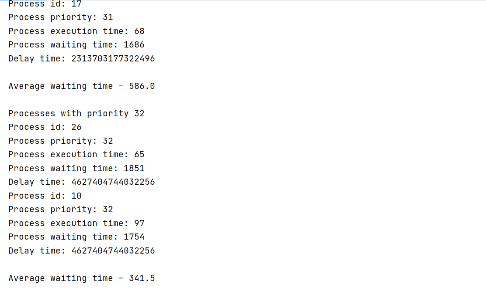
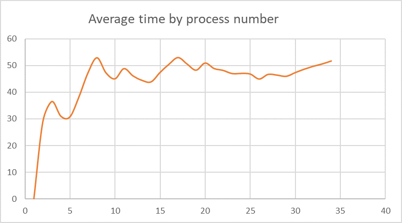
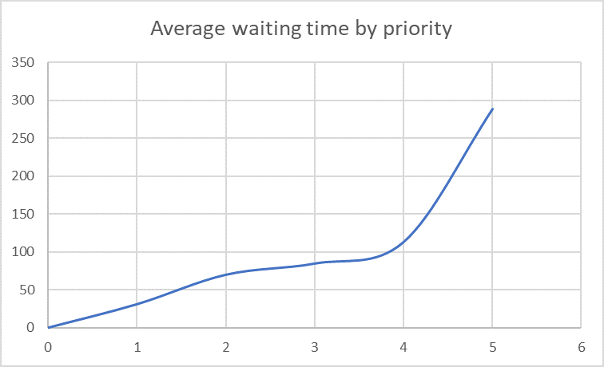
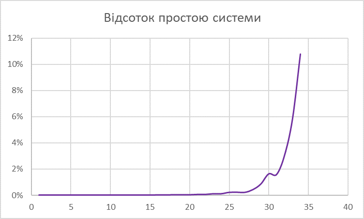

# Task dispatcher, based on FIFO

## Algorithm description

**FIFO** is the simplest process planning strategy and is that the resource is transferred to the process that first turned to it. 
When a process enters the queue of finished processes, the process control block joins the tail of the queue. 
The average waiting time for a FIFO strategy is often quite large and depends on the order in which the processes enter the queue of finished processes.

**Scheduling without redistribution** of CPU time at the time of execution of the application is a non-displacing multitasking (**relative priority RP**) - 
a method of scheduling in which the active process is performed until he gives control to the task manager to select another ready process.

## Examples

## Graphs

